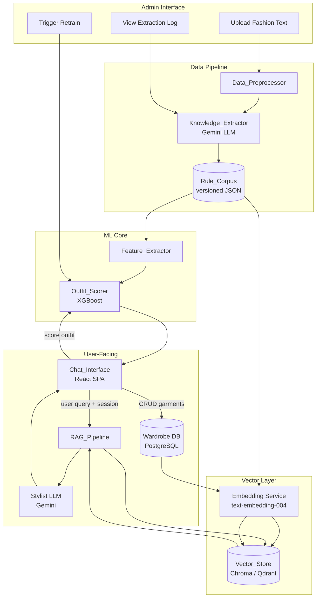
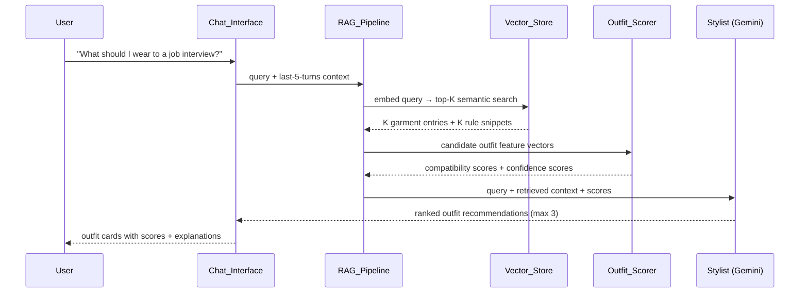
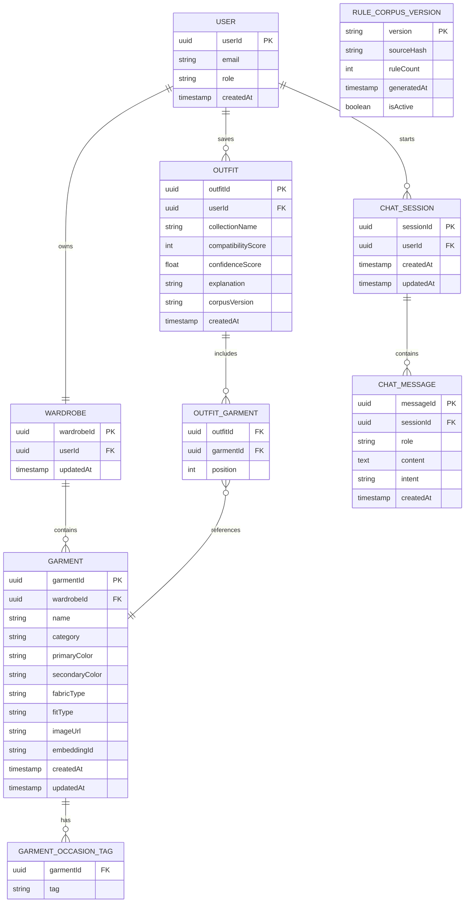

# Design Document — AI Wardrobe Stylist & Recommendation Engine

## Overview

The AI Wardrobe Stylist is a web-based outfit recommendation system that combines a structured fashion rule corpus, an XGBoost scoring model, and a Retrieval-Augmented Generation (RAG) chatbot to deliver personalized styling advice grounded in authoritative fashion knowledge.

The system is organized around four sequential build phases:

1. **Data Acquisition** — raw fashion text is cleaned and normalized by the `Data_Preprocessor`
2. **Knowledge Extraction** — the `Knowledge_Extractor` (Gemini LLM) parses cleaned text and emits structured JSON rules
3. **Structured Representation** — rules are compiled into a versioned `Rule_Corpus` JSON file conforming to a published schema
4. **Predictive Integration** — rule features feed the `Outfit_Scorer` (XGBoost) and are embedded into the `Vector_Store` for RAG retrieval

Users interact through a responsive `Chat_Interface` that maintains session history, displays scored outfit cards with images, and supports outfit saving. Admins manage corpus updates, trigger retraining, and review extraction logs through a dedicated admin panel.

### Key Design Decisions

- **XGBoost over deep learning** for scoring: interpretable feature weights, fast inference, and easy retraining without GPU hardware.
- **RAG before generation**: grounding the Gemini response in retrieved garment embeddings and rule snippets prevents hallucination and keeps advice wardrobe-specific.
- **Versioned Rule_Corpus**: semantic versioning on the corpus file allows rollback, reproducible scoring, and audit trails.
- **Stateless scoring API**: the `Outfit_Scorer` accepts a self-contained feature vector, making it independently testable and cacheable.

---

## Architecture



### Request Flow — Chat Query



---

## Components and Interfaces

### 1. Data_Preprocessor

Responsible for cleaning raw fashion text before LLM ingestion.

**Input:** `.txt` or `.pdf` file ≤ 10 MB  
**Output:** cleaned `.txt` file + preprocessing report JSON

```typescript
interface PreprocessingReport {
  inputFileName: string;
  inputSizeBytes: number;
  outputSizeBytes: number;
  charactersRemoved: number;
  unicodeNormalizationsApplied: number;
  smartQuotesReplaced: number;
  dashesNormalized: number;
  wordCountAfterProcessing: number;
  warnings: string[];   // e.g. "document may be too short for meaningful extraction"
  processedAt: string;  // ISO 8601
}
```

**Normalization steps (in order):**
1. Extract text from PDF (if applicable) — strip headers, footers, page numbers via heuristics (repeated line patterns at fixed offsets)
2. Remove Unicode control characters in categories Cc and Cf, excluding U+0009 (tab) and U+000A (newline)
3. Normalize to NFC form
4. Replace smart quotes (`"` `"` `'` `'`) with `"` and `'`
5. Replace en-dash (`–`) and em-dash (`—`) with ` - `

---

### 2. Knowledge_Extractor

LLM pipeline that reads cleaned fashion text and emits a `Rule_Corpus` JSON file.

**Input:** cleaned `.txt` file  
**Output:** versioned `Rule_Corpus` JSON

```typescript
interface ExtractionJob {
  jobId: string;
  inputFileHash: string;   // SHA-256
  startedAt: string;       // ISO 8601
  completedAt?: string;
  status: "running" | "completed" | "failed";
  corpusVersion?: string;  // e.g. "2.1.0"
  ruleCount?: number;
  unresolvedPassages: UnresolvedPassage[];
}

interface UnresolvedPassage {
  passageId: string;
  text: string;
  confidenceScore: number;  // < 0.5 by definition
  reason: string;
  detectedAt: string;       // ISO 8601
}
```

**LLM Prompt Strategy:**
- Chunk the cleaned text into ≤ 2,000-token segments with 200-token overlap
- Each chunk is sent to Gemini with a system prompt instructing it to output a JSON array of rule objects conforming to the `Rule_Corpus` schema
- Responses are validated against the JSON schema; invalid responses are retried up to 3 times with a corrective prompt
- Rules from all chunks are merged, deduplicated by content hash, and assigned a corpus-level sequential ID

---

### 3. Rule_Corpus (Versioned JSON)

The single source of truth for all styling knowledge in the system.

**Schema:**

```typescript
interface RuleCorpus {
  version: string;        // semantic version, e.g. "2.1.0"
  generatedAt: string;    // ISO 8601
  sourceHash: string;     // SHA-256 of the cleaned input text
  ruleCount: number;
  rules: StyleRule[];
}

type RuleType =
  | "color_pairing"
  | "fabric_compatibility"
  | "occasion_appropriateness"
  | "layering_proportion"
  | "fit_combination"
  | "footwear_match"
  | "pattern_compatibility";

interface StyleRule {
  ruleId: string;          // corpus-scoped UUID
  ruleType: RuleType;
  description: string;
  conditions: Record<string, unknown>;   // rule-type-specific key-value features
  score: number;           // 0–1: weight contribution when rule is satisfied
  confidence: number;      // 0–1: LLM extraction confidence
  sourcePassage?: string;  // verbatim excerpt from source text
}
```

**Versioning policy:**
- Major bump: schema-breaking changes
- Minor bump: new rule types added
- Patch bump: rule edits, confidence adjustments

---

### 4. Feature_Extractor

Transforms a candidate `Outfit` (set of `Garment` objects) into a numeric feature vector for the `Outfit_Scorer`.

```typescript
interface OutfitFeatureVector {
  outfitId: string;
  corpusVersion: string;
  colorCompatibilityScore: number;      // 0–100
  fabricCompatibilityScore: number;     // 0–100
  occasionMatchScore: number;           // 0–100
  garmentCategoryBalanceScore: number;  // 0–100
  patternCompatibilityScore: number;    // 0–100
  fitCombinationScore: number;          // 0–100
  seasonMaterialMatchScore: number;     // 0–100
  rulesSatisfied: number;               // count of rules with binary satisfaction = 1
  totalRulesApplicable: number;
}
```

**Sub-score computation (aligned with `scoring_weights` in rules.json):**

| Sub-score | Weight | Computation |
|---|---|---|
| Color compatibility | 0.30 | Lookup `good_pairs` / `bad_pairs`; neutral bonus |
| Style/occasion match | 0.25 | Intersection of garment occasion tags with query occasion |
| Footwear match | 0.20 | `footwear_occasion_rules` lookup |
| Pattern compatibility | 0.10 | `max_patterns_in_outfit` constraint check |
| Fit combination | 0.10 | `fit_combination_rules` lookup |
| Season/material match | 0.05 | `season_material_rules` lookup |

---

### 5. Outfit_Scorer

XGBoost binary classifier retrained as a ranker. Accepts a feature vector and returns a compatibility score and confidence score.

**Model interface:**

```typescript
interface ScoringRequest {
  outfitId: string;
  features: OutfitFeatureVector;
}

interface ScoringResponse {
  outfitId: string;
  compatibilityScore: number;    // 0–100 integer
  confidenceScore: number;       // 0–1 float
  corpusVersion: string;
  scoredAt: string;              // ISO 8601
  error?: ScoringError;
}

type ScoringError =
  | { code: "MISSING_FEATURES"; missingFields: string[] }
  | { code: "MODEL_UNAVAILABLE"; message: string };
```

**When any required feature is missing:** return `compatibilityScore: -1`, `confidenceScore: 0`.

**Cache invalidation:** a Redis hash maps `corpusVersion → Set<outfitId>`. When the active corpus version changes, all cached scores are invalidated.

**Retraining pipeline:**
1. Admin triggers retrain via Admin API
2. Worker loads new `Rule_Corpus`, recomputes feature vectors for all historical outfits in training set
3. XGBoost model trained with 5-fold cross-validation
4. New model artifact saved with corpus version tag
5. Health check: score a fixed validation set; if mean score deviation > 10 points vs. previous model, alert Admin before promoting
6. Model promoted to active; old model archived

---

### 6. Vector_Store

Stores and serves embeddings for garments and styling rules.

**Embedding model:** `text-embedding-004` (Google) — 768-dimensional vectors  
**Backend:** Chroma (development) / Qdrant (production)

```typescript
interface EmbeddingRecord {
  id: string;                 // garmentId or ruleId
  type: "garment" | "rule";
  userId?: string;            // present for garment records
  corpusVersion?: string;     // present for rule records
  vector: number[];           // 768 dimensions
  metadata: Record<string, unknown>;
  updatedAt: string;          // ISO 8601
}

interface RetrievalRequest {
  queryText: string;
  userId: string;
  k: number;                  // 1–20, default 5
  filters?: {
    type?: "garment" | "rule" | "both";
    occasionTags?: string[];
  };
}

interface RetrievalResult {
  records: Array<EmbeddingRecord & { similarityScore: number }>;
  lowConfidence: boolean;     // true when fewer than 3 results exceed threshold 0.7
  retrievedAt: string;        // ISO 8601
}
```

**Embedding update SLA:** garment CRUD → update within 10 seconds; corpus version change → re-embed all rules within 5 minutes (minimum 90% success).

---

### 7. RAG_Pipeline

Orchestrates retrieval and context assembly before calling the Stylist LLM.

```typescript
interface RAGRequest {
  sessionId: string;
  userId: string;
  userQuery: string;            // max 1,000 chars
  conversationHistory: Array<{ role: "user" | "assistant"; content: string }>;  // last 5 pairs
  k?: number;                   // retrieval K, default 5
}

interface RAGContext {
  retrievedGarments: EmbeddingRecord[];
  retrievedRules: EmbeddingRecord[];
  outfitScores: ScoringResponse[];
  lowConfidence: boolean;
  queryIntent: QueryIntent;
}

type QueryIntent =
  | "outfit_suggestion"
  | "color_pairing"
  | "fabric_pairing"
  | "wardrobe_gap_analysis"
  | "style_tips"
  | "unknown";
```

**Intent classification:** keyword + embedding similarity approach. If `queryIntent === "unknown"`, the pipeline short-circuits and returns a clarifying prompt without invoking the LLM.

**Fallback behavior:**
- Fewer than 3 results above similarity threshold 0.7 → use top-3 by score, set `lowConfidence: true`
- Zero results → return error, do not invoke Stylist
- Empty wardrobe on outfit suggestion → return prompt to add garments, do not invoke RAG or Scorer

---

### 8. Stylist LLM (Gemini)

Generates the final natural-language response grounded in the RAG context.

**System prompt contract:**
- Always reference specific garment names from the retrieved context
- Include `compatibilityScore` for each recommended outfit
- When `confidenceScore < 0.6`, append: *"Note: This suggestion is based on limited data (confidence: {score}). Results may vary."*
- Limit outfit recommendations to 3 per response
- Each outfit explanation must be 20–100 words referencing at least one styling rule

**Error contract:** if Gemini is unavailable, return a user-facing error within 10 seconds.

---

### 9. Chat_Interface

React SPA with a conversational UI and a wardrobe management panel.

**Component tree (simplified):**

```
App
├── WardrobePanel
│   ├── GarmentList
│   ├── GarmentForm (add/edit)
│   └── GarmentCard (with image preview)
├── ChatPanel
│   ├── MessageList
│   │   └── OutfitCard (garment names, score, explanation, images)
│   ├── MessageInput (max 1,000 chars with live counter)
│   └── IntentBadge
└── AdminPanel (role-gated)
    ├── CorpusUploader
    ├── ExtractionLogViewer
    └── RetrainTrigger
```

**Responsive breakpoints:**
- 320 px–767 px: single-column stacked layout; wardrobe panel collapses to a drawer
- 768 px–1279 px: two-column split (wardrobe left, chat right)
- 1280 px–1920 px: three-column with admin panel visible for Admin role

---

## Data Models

### Garment

```typescript
interface Garment {
  garmentId: string;           // UUID v4
  userId: string;
  name: string;                // 1–100 characters
  category: GarmentCategory;
  primaryColor: string;
  secondaryColor?: string;
  fabricType: string;
  occasionTags: OccasionTag[]; // minimum 1
  fitType?: FitType;
  styleTag?: string;
  imageUrl?: string;           // JPEG or PNG, ≤ 5 MB at upload time
  embeddingId?: string;        // reference to Vector_Store record
  createdAt: string;           // ISO 8601
  updatedAt: string;           // ISO 8601
}

type GarmentCategory =
  | "top" | "bottom" | "outerwear" | "footwear" | "accessory" | "full_outfit";

type OccasionTag =
  | "casual" | "formal" | "business casual" | "outdoor" | "sport"
  | "date night" | "travel" | "festival" | "wedding" | "everyday";

type FitType =
  | "slim fit" | "regular fit" | "relaxed fit" | "oversized fit"
  | "tailored fit" | "skinny fit" | "athletic fit" | "loose fit" | "wide fit";
```

### Outfit

```typescript
interface Outfit {
  outfitId: string;            // UUID v4
  userId: string;
  garmentIds: string[];        // ordered: [top, bottom, footwear, outerwear?, accessory?]
  occasion?: OccasionTag;
  compatibilityScore?: number; // 0–100
  confidenceScore?: number;    // 0–1
  explanation?: string;        // 20–100 words
  corpusVersion?: string;
  savedToCollection?: string;  // collection name, 1–50 chars
  createdAt: string;           // ISO 8601
}
```

### ChatSession

```typescript
interface ChatSession {
  sessionId: string;           // UUID v4
  userId: string;
  messages: ChatMessage[];
  createdAt: string;           // ISO 8601
  updatedAt: string;
}

interface ChatMessage {
  messageId: string;
  role: "user" | "assistant";
  content: string;
  outfits?: Outfit[];          // populated on assistant messages with recommendations
  intent?: QueryIntent;
  timestamp: string;           // ISO 8601
}
```

### Wardrobe

```typescript
interface Wardrobe {
  wardrobeId: string;          // UUID v4
  userId: string;
  garments: Garment[];
  collections: OutfitCollection[];
  createdAt: string;
  updatedAt: string;
}

interface OutfitCollection {
  collectionId: string;
  name: string;                // 1–50 characters
  outfitIds: string[];
  createdAt: string;
}
```

### Admin Data

```typescript
interface ExtractionLog {
  logId: string;
  jobId: string;
  unresolvedPassages: UnresolvedPassage[];
  createdAt: string;
}

interface RetrainingJob {
  jobId: string;
  triggeredBy: string;         // adminUserId
  corpusVersion: string;
  status: "queued" | "running" | "completed" | "failed";
  startedAt?: string;
  completedAt?: string;
  validationDelta?: number;    // mean score deviation from previous model
}
```

### Database Schema Overview



---

## Correctness Properties

*A property is a characteristic or behavior that should hold true across all valid executions of a system — essentially, a formal statement about what the system should do. Properties serve as the bridge between human-readable specifications and machine-verifiable correctness guarantees.*

### Property 1: Rule_Corpus Round-Trip Fidelity

*For any* valid `Rule_Corpus` JSON object, parsing it into a corpus object, serializing it back to JSON, and parsing the result again SHALL produce an object with identical rule count, identical type distribution, and identical field values across all rules as the original.

**Validates: Requirements 2.6**

---

### Property 2: Garment Field Validation Invariant

*For any* garment submission where one or more required fields (name, category, primaryColor, fabricType, occasionTags) are absent or empty, the system SHALL reject the submission and return a descriptive validation error that identifies every missing field; the Wardrobe SHALL remain unchanged.

**Validates: Requirements 1.3, 1.8**

---

### Property 3: Image Upload Constraint Enforcement

*For any* file submitted as a garment image, if the file size exceeds 5 MB or the MIME type is not `image/jpeg` or `image/png`, the system SHALL reject it and the garment record SHALL NOT be created or updated with that file.

**Validates: Requirements 1.6, 1.7**

---

### Property 4: Scoring Monotonicity

*For any* two outfits A and B where A satisfies strictly more styling rules than B (counting each rule as binary 0 or 1), the `Outfit_Scorer` SHALL assign A a compatibility score equal to or greater than B's score.

**Validates: Requirements 3.6**

---

### Property 5: Missing-Feature Score Sentinel

*For any* outfit feature vector where at least one required sub-score (Color_Compatibility_Score, Fabric_Compatibility_Score, occasion match, or garment category balance) cannot be computed, the `Outfit_Scorer` SHALL return `compatibilityScore: -1` and `confidenceScore: 0` and SHALL NOT return a partial score.

**Validates: Requirements 3.8**

---

### Property 6: Low-Confidence Disclaimer Invariant

*For any* outfit recommendation where `confidenceScore < 0.6`, the Stylist response SHALL contain a disclaimer that includes the actual confidence score value.

**Validates: Requirements 3.4, 5.4**

---

### Property 7: RAG Retrieval K Bounds

*For any* valid retrieval request with K in the range [1, 20], the `Vector_Store` SHALL return exactly min(K, available_records) results; K values outside [1, 20] SHALL be rejected with a validation error.

**Validates: Requirements 4.2**

---

### Property 8: Low-Similarity Fallback Flag

*For any* retrieval result set where fewer than 3 records exceed similarity threshold 0.7, the `RAG_Pipeline` output SHALL include `lowConfidence: true` in the Stylist context, and the top-3 results by raw similarity score SHALL be used regardless of threshold.

**Validates: Requirements 4.6**

---

### Property 9: Chat Message Length Enforcement

*For any* user message submission, if the message exceeds 1,000 characters the `Chat_Interface` SHALL reject the message client-side before it is sent and SHALL display an inline character-count error; the message SHALL NOT reach the backend.

**Validates: Requirements 5.1**

---

### Property 10: Session History Truncation

*For any* chat session with more than 5 prior user–assistant message pairs, the context passed to the Stylist SHALL contain exactly the last 5 pairs; older pairs SHALL be excluded.

**Validates: Requirements 5.7**

---

### Property 11: Collection Name Validation

*For any* collection name submission, names shorter than 1 character or longer than 50 characters SHALL be rejected with a validation error before persistence; valid names in the range [1, 50] SHALL be accepted.

**Validates: Requirements 6.8**

---

### Property 12: Preprocessing Character Removal Completeness

*For any* input document, after preprocessing, the output text SHALL contain zero Unicode characters in categories Cc or Cf except U+0009 and U+000A; the preprocessing report SHALL record the exact count of removed characters.

**Validates: Requirements 7.1, 7.3**

---

### Property 13: Unicode Normalization Idempotence

*For any* text string that has already been NFC-normalized, applying the normalization step again SHALL produce an identical string (idempotence).

**Validates: Requirements 7.2**

---

### Property 14: Vector_Store Embedding SLA

*For any* garment create, update, or delete operation, the corresponding embedding in the `Vector_Store` SHALL be updated or removed within 10 seconds; if the update fails, a log entry with timestamp and garment ID SHALL be created and an error indicator returned to the caller.

**Validates: Requirements 1.4, 1.5, 4.4**

---

## Error Handling

### Error Taxonomy

| Code | HTTP | Trigger | User-Visible Message |
|---|---|---|---|
| `VALIDATION_ERROR` | 400 | Missing/invalid fields | Field-level descriptive message |
| `FILE_TOO_LARGE` | 413 | Upload > size limit | "File exceeds the {N} MB limit." |
| `UNSUPPORTED_FORMAT` | 415 | Wrong MIME type | "Only {formats} files are accepted." |
| `INTENT_UNKNOWN` | 200 | Unrecognized query | Clarifying prompt with supported intents |
| `EMPTY_WARDROBE` | 200 | Outfit request with 0 garments | Prompt to add garments first |
| `LLM_UNAVAILABLE` | 503 | Gemini timeout/failure | "Styling service temporarily unavailable. Please retry in a moment." |
| `VECTOR_STORE_UNAVAILABLE` | 503 | Vector_Store unreachable | Error returned to RAG; not silent |
| `SCORER_FAILED` | 200 | XGBoost scoring failure | Partial recommendation with "scoring unavailable" notice |
| `ZERO_RETRIEVAL_RESULTS` | 500 | No embeddings returned | Error to Stylist; no generation |
| `INTERNAL_ERROR` | 500 | Unexpected exception | Generic message + unique request ID; no internals exposed |

### Error Logging

Every error is logged to a persistent log store (e.g., Cloud Logging / structured JSON file) with:
- `severity`: DEBUG / INFO / WARN / ERROR / CRITICAL
- `timestamp`: ISO 8601
- `requestId`: UUID v4 — returned to client for support reference
- `component`: e.g., `RAG_Pipeline`, `Outfit_Scorer`
- `message`: human-readable description
- `context`: sanitized request metadata (no PII, no model parameters)

### LLM Availability

The Stylist wraps Gemini calls with a 8-second timeout. On timeout or non-2xx response:
1. Log error at CRITICAL severity
2. Return `LLM_UNAVAILABLE` response within 10 seconds of the call failing
3. Do not retry inline (to avoid exceeding user-facing SLA); a background retry queue can reprocess deferred tasks

### Partial Scoring Fallback

When `Outfit_Scorer` is unavailable:
1. RAG_Pipeline continues without scorer results
2. Stylist generates at least one outfit suggestion using RAG context alone
3. Response indicates "Compatibility scoring is currently unavailable"
4. Full error logged at ERROR severity

---

## Testing Strategy

### Dual Testing Approach

Unit tests cover specific examples, edge cases, and error conditions. Property-based tests verify universal invariants across large randomized input spaces. Both layers are required for comprehensive coverage.

### Property-Based Testing

**Library:** [fast-check](https://fast-check.dev/) (TypeScript/JavaScript) — runs in Node.js, integrates with Jest/Vitest.

**Minimum iterations per property test:** 100

**Tag format:** `// Feature: ai-wardrobe-stylist, Property {N}: {property_text}`

Each correctness property in the design document maps to exactly one property-based test. Generators produce random but realistic inputs (garment names drawn from a realistic vocabulary, colors drawn from the known color set, etc.).

### Unit Test Coverage Targets

| Component | Test Approach | Examples |
|---|---|---|
| `Data_Preprocessor` | Unit + property | NFC idempotence, control char removal, PDF extraction |
| `Knowledge_Extractor` | Unit + integration | Schema validation, versioning, unresolved passage logging |
| `Feature_Extractor` | Unit + property | Sub-score range bounds, monotonicity vectors |
| `Outfit_Scorer` | Unit + property | Monotonicity, missing-feature sentinel, confidence threshold |
| `RAG_Pipeline` | Unit + integration | Fallback logic, K bounds, intent classification |
| `Chat_Interface` | Unit + E2E | Character limit, session history truncation, responsive layout |
| `Vector_Store` | Integration | Embedding SLA, partial re-embedding success rate |

### Integration Testing

- **Vector_Store update latency**: ingest a garment, measure time until embedding is queryable (must be < 10 s)
- **Corpus re-embedding throughput**: activate a new corpus version, measure time until all rules are embedded (must be < 5 min, ≥ 90% success)
- **Retraining pipeline**: trigger retrain, confirm model artifact is active within 30 min
- **End-to-end chat flow**: send a query, assert outfit card rendered with score and explanation

### Smoke Tests

- System starts with valid configuration (DB connection, Vector_Store, LLM API key)
- Admin panel accessible only to Admin-role users
- Health endpoint returns 200 with component statuses

### Accessibility

- All interactive elements have ARIA labels
- Color contrast meets WCAG 2.1 AA (minimum 4.5:1 for text)
- Keyboard navigation through chat and wardrobe panels
- Responsive layout tested at 320 px, 768 px, 1280 px, and 1920 px

### Performance

- Chat response P95 < 8 seconds under < 100 concurrent users
- Wardrobe CRUD P95 < 2 seconds
- RAG retrieval P95 < 1 second
